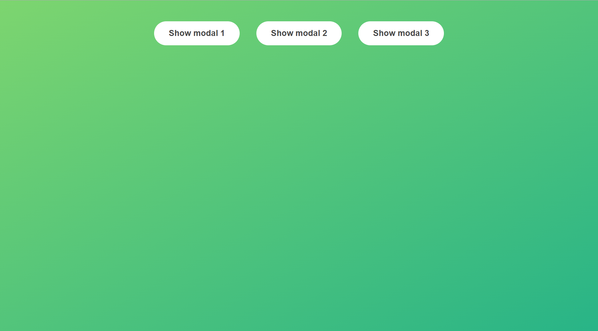
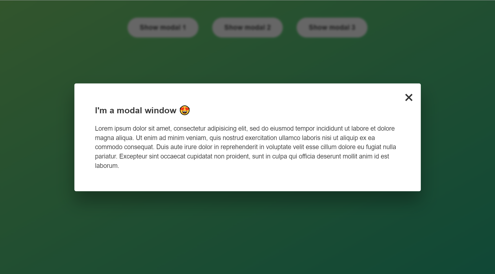

# Simple Modal Window

This is a small project from [Jonas](https://github.com/jonasschmedtmann) Complete Javascript Course.

## Screenshot

## Setup

1. Clone this repo and run `index.html` on your browser to try it.
2. You can use `esc` key to close the modal window.

## Credit

1. https://www.udemy.com/course/the-complete-javascript-course/
